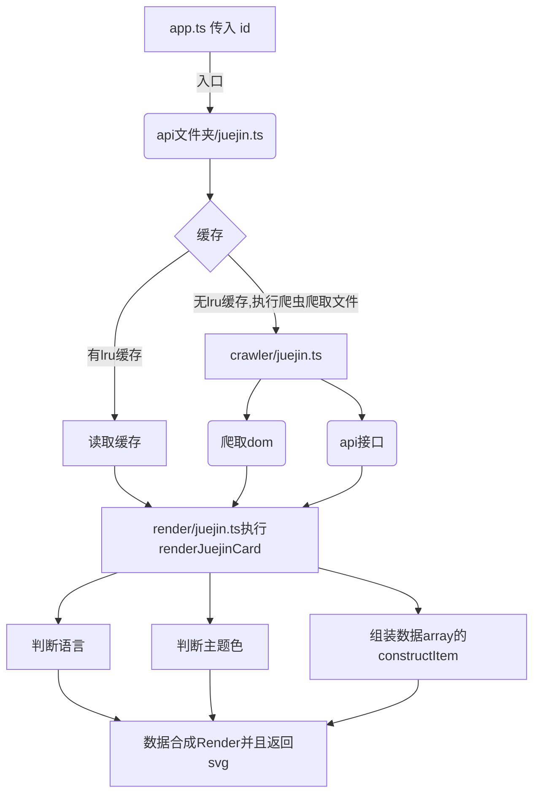

# 从0教你搭建自己的服务端数据卡片


## 1.1 从0搭建基本web结构

```shell
│  app.ts
│  package.json
│  README.md
├─common
│      cache.ts
│      theme.ts
│      utils.ts
└─public
```

我们首先把这些基础的文件填充一下


### 1.1.1 app.ts

- 简单的api请求示例，没啥好说的

  ```ts
  const express = require('express');
  const http = require('http');
  const serveStatic = require('serve-static');
  const app = express();
  const { cacheTime } = require('./common/cache');
  const path = require('path');;
  app.use('/api/test', function(req, res) {
      res.send({
          code:200,
          message:cacheTime
      })
  });
  app.use(
    serveStatic(path.join(__dirname, 'public'), {
      maxAge: cacheTime * 1000,
    })
  );
  const server = http.createServer(app);
  server.listen(3000);
  module.exports = app;
  ```

  

### 1.1.2 common/cache.ts 

- 经典lru，不懂的可以百度

  ```ts
  // https://github.com/isaacs/node-lru-cache
  const LRU = require('lru-cache');
  
  const cacheTime = process.env.CACHE_TIME || 100 * 60; // 100 min
  const maxCacheItems = process.env.MAX_CACHE_ITEMS || 1024;
  
  const options = {
    max: maxCacheItems,
    // how long to live in ms
    ttl: (cacheTime as number) * 1000,
    // return stale items before removing from cache?
    allowStale: true,
    updateAgeOnGet: false,
    updateAgeOnHas: false,
  };
  
  const cache = new LRU(options);
  
  export {
    cache,
    cacheTime,
  };
  
  ```

  

### 1.1.3 common/theme.ts 

- 自定义主题的地方

  ```ts
  let themes = {
    'light': {
      titleColor: '#212121',
      backgroundColor: '#ffffff',
      labelColor: '#9e9e9e',
      valueColor: '#212121'
    },
  }
  function getTheme(theme = 'light') {
    if (theme in themes) {
      return themes[theme];
    } else {
      return themes['light'];
    }
  }
  module.exports = getTheme;
  ```

### 1.1.3 common/utils.ts

- 一些工具方法

```ts
const mobileConfig = {
  headers: {
    'User-Agent':
      'Mozilla/5.0 (Linux; Android 5.0; SM-G900P Build/LRX21T) AppleWebKit/537.36 (KHTML, like Gecko) Chrome/88.0.4324.104 Mobile Safari/537.36',
  },
};
const desktopConfig = {
  headers: {
    'User-Agent':
      'Mozilla/5.0 (Windows NT 10.0; Win64; x64) AppleWebKit/537.36 (KHTML, like Gecko) Chrome/91.0.4472.101 Safari/537.36',
  },
};

const processData = (data) => {
  for (let attr in data) {
    if (typeof data[attr] === 'number') {
      let num = data[attr];
      let numStr = num;
      if (num >= 1000000) {
        numStr = (num / 1000000).toFixed(1).toString();
        if (numStr.endsWith('.0')) {
          numStr = numStr.slice(0, -2);
        }
        numStr += 'M';
      } else if (num >= 10000) {
        numStr = (num / 1000).toFixed(1).toString();
        if (numStr.endsWith('.0')) {
          numStr = numStr.slice(0, -2);
        }
        numStr += 'k';
      }
      data[attr] = numStr;
    }
  }
};

const isEndsWithASCII = (str) => {
  if (str.length === 0) return false;
  return str.charCodeAt(str.length - 1) <= 127;
};

const encodeHTML = (str) => {
  return str
    .replace(/&/g, '&amp;')
    .replace(/</g, '&lt;')
    .replace(/>/g, '&gt;')
    .replace(/"/g, '&quot;')
    .replace(/'/g, '&apos;');
};

module.exports = {
  mobileConfig,
  desktopConfig,
  processData,
  isEndsWithASCII,
  encodeHTML,
};

```


### 1.1.4 tsconfig.json

- 一些数据结构我才加typescript了。其他的懒得加。所以把strict 关掉了

```ts
{
  "compilerOptions": {
    "target": "esnext", // 使用最新的 ECMAScript 版本
    "module": "commonjs",
    "lib": [
      "ES2022",
      "dom",
      "es6"
    ],
    "rootDir": "./", /* Specify the root folder within your source files. */
    "strict": false /* Enable all strict type-checking options. */,
    "noImplicitThis": false,
    "skipLibCheck": true /* Skip type checking all .d.ts files. */,
    "esModuleInterop": true, // important!
  },
  "exclude": [
    "node_modules"
  ]
}
```


### 1.1.5 package.json

- 可以看到npm run dev 启动，这里启动用到了concurrently ，  nodemon 和 tsc 的 watch。主要是因为 nodemon 和 tsc 并不能够同时执行，所以需要 concurrently  作为媒介使得双方同时启动
- 然后是 cheerio,axios都 是 用来执行爬取 html 的工具

```json
{
    "name": "data-card",
    "version": "0.1.0",
    "description": "",
    "main": "app.js",
    "scripts": {
        "start": "node ./app.js",
        "test": "node ./test.js",
        "dev": "concurrently \"npm run dev:server\" \"npm run dev:compile\"",
        "dev:compile": "tsc --project ./ --watch ",
        "dev:server": "nodemon ./app.js"
    },
    "repository": {
        "type": "git",
        "url": "git+https://github.com/songquanpeng/readme-stats.git"
    },
    "author": "",
    "license": "MIT",
    "bugs": {
        "url": "https://github.com/songquanpeng/readme-stats/issues"
    },
    "homepage": "https://github.com/songquanpeng/readme-stats#readme",
    "dependencies": {
        "axios": "^0.21.1",
        "cheerio": "^1.0.0-rc.5",
        "concurrently": "^8.2.1",
        "express": "^4.17.1",
        "form-data": "^4.0.0",
        "lru-cache": "^7.14.1",
        "serve-static": "^1.15.0",
        "typescript": "^5.2.2"
    },
    "devDependencies": {
        "nodemon": "^2.0.7",
        "prettier": "^2.2.1"
    },
    "prettier": {
        "singleQuote": true
    },
    "engines": {
        "node": "16.x"
    }
}

```


### 1.1.6 启动

这个时候我们可以 npm run dev 启动一下。然后你就可以试试访问你的

> http://localhost:3000/api/test

如果这个时候界面中显示

```ts
{
  "code": 200,
  "message": "success"
}
```

那么你的基本结构就已经完成了


## 1.2 添加服务端爬取卡片(用掘金作为示例)


我们首先需要定义我们的传参是啥 | http://localhost:3000/api/juejin?id=3004311888208296&lang=zh-CN

```ts
interface param{
    id:string:number;
	lang:"zh-CN" | any;
	theme:"black" | "white"
}
```





