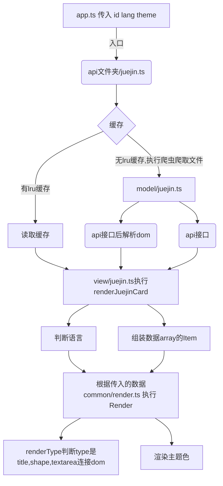

# 从0教你搭建自己的服务端数据卡片


## 1.1 从0搭建基本web结构

```shell
│  app.ts
│  package.json
│  README.md
├─common
│      cache.ts
│      theme.ts
│      utils.ts
└─public
```

我们首先把这些基础的文件填充一下


### 1.1.1 app.ts

- 简单的api请求示例，没啥好说的

  ```ts
  const express = require('express');
  const http = require('http');
  const serveStatic = require('serve-static');
  const app = express();
  const { cacheTime } = require('./common/cache');
  const path = require('path');;
  app.use('/api/test', function(req, res) {
      res.send({
          code:200,
          message:cacheTime
      })
  });
  app.use(
    serveStatic(path.join(__dirname, 'public'), {
      maxAge: cacheTime * 1000,
    })
  );
  const server = http.createServer(app);
  server.listen(3000);
  module.exports = app;
  ```

  

### 1.1.2 common/cache.ts 

- 经典lru

  ```ts
  // https://github.com/isaacs/node-lru-cache
  const LRU = require('lru-cache');
  
  const cacheTime = process.env.CACHE_TIME || 100 * 60; // 100 min
  const maxCacheItems = process.env.MAX_CACHE_ITEMS || 1024;
  
  const options = {
    max: maxCacheItems,
    // how long to live in ms
    ttl: (cacheTime as number) * 1000,
    // return stale items before removing from cache?
    allowStale: true,
    updateAgeOnGet: false,
    updateAgeOnHas: false,
  };
  
  const cache = new LRU(options);
  
  export {
    cache,
    cacheTime,
  };
  
  ```

  

### 1.1.3 common/theme.ts 

- 自定义主题的地方

  ```ts
  interface ThemeType{
    IconColor:string;
    TextColor:string;
    BackgroundColor:string
  }
  let themes:Record<string,ThemeType> = {
    'black': {
      IconColor: 'Lightblue',
      TextColor: 'rgba(250,250,250,1)',
      BackgroundColor:"rgba(0,0,0,0.85)"
    },
    'white': {
      IconColor: '#2f80ed',
      TextColor: '#434d58',
      BackgroundColor:"#fffefe"
    },
    "default":{
      IconColor: '#2f80ed',
      TextColor: '#434d58',
      BackgroundColor:"#fffefe"
    }
  };
  function getTheme(theme = 'light') {
    if (theme in themes) {
      return themes[theme] as ThemeType;
    } else {
      return themes['light'] as ThemeType;
    }
  }
  
  export {
    getTheme
  }
  ```

### 1.1.3 common/utils.ts

- 一些工具方法

```ts
const mobileConfig = {
  headers: {
    'User-Agent':
      'Mozilla/5.0 (Linux; Android 5.0; SM-G900P Build/LRX21T) AppleWebKit/537.36 (KHTML, like Gecko) Chrome/88.0.4324.104 Mobile Safari/537.36',
  },
};
const desktopConfig = {
  headers: {
    'User-Agent':
      'Mozilla/5.0 (Windows NT 10.0; Win64; x64) AppleWebKit/537.36 (KHTML, like Gecko) Chrome/91.0.4472.101 Safari/537.36',
  },
};

const isEndsWithASCII = (str) => {
  if (str.length === 0) return false;
  return str.charCodeAt(str.length - 1) <= 127;
};

const encodeHTML = (str) => {
  return str
    .replace(/&/g, '&amp;')
    .replace(/</g, '&lt;')
    .replace(/>/g, '&gt;')
    .replace(/"/g, '&quot;')
    .replace(/'/g, '&apos;');
};

export  {
  mobileConfig,
  desktopConfig,
  isEndsWithASCII,
  encodeHTML,
};

```


### 1.1.4 tsconfig.json

- 一些数据结构我才加typescript了。其他的懒得加。所以把strict 关掉了

```ts
{
  "compilerOptions": {
    "target": "esnext", // 使用最新的 ECMAScript 版本
    "module": "commonjs",
    "lib": [
      "ES2022",
      "dom",
      "es6"
    ],
    "rootDir": "./", /* Specify the root folder within your source files. */
    "strict": false /* Enable all strict type-checking options. */,
    "noImplicitThis": false,
    "skipLibCheck": true /* Skip type checking all .d.ts files. */,
    "esModuleInterop": true, // important!
  },
  "exclude": [
    "node_modules"
  ]
}
```


### 1.1.5 package.json

- 可以看到npm run dev 启动，这里启动用到了concurrently ，  nodemon 和 tsc 的 watch。主要是因为 nodemon 和 tsc 并不能够同时执行，所以需要 concurrently  作为媒介使得双方同时启动
- 然后是 cheerio,axios都 是 用来执行爬取 html 的工具

```json
{
    "name": "data-card",
    "version": "0.1.0",
    "description": "",
    "main": "app.js",
    "scripts": {
        "start": "node ./app.js",
        "test": "node ./test.js",
        "dev": "concurrently \"npm run dev:server\" \"npm run dev:compile\"",
        "dev:compile": "tsc --project ./ --watch ",
        "dev:server": "nodemon ./app.js"
    },
    "repository": {
        "type": "git",
        "url": "git+https://github.com/songquanpeng/readme-stats.git"
    },
    "author": "",
    "license": "MIT",
    "bugs": {
        "url": "https://github.com/songquanpeng/readme-stats/issues"
    },
    "homepage": "https://github.com/songquanpeng/readme-stats#readme",
    "dependencies": {
        "axios": "^0.21.1",
        "cheerio": "^1.0.0-rc.5",
        "concurrently": "^8.2.1",
        "express": "^4.17.1",
        "form-data": "^4.0.0",
        "lru-cache": "^7.14.1",
        "serve-static": "^1.15.0",
        "typescript": "^5.2.2"
    },
    "devDependencies": {
        "nodemon": "^2.0.7",
        "prettier": "^2.2.1"
    },
    "prettier": {
        "singleQuote": true
    },
    "engines": {
        "node": "16.x"
    }
}

```


### 1.1.6 启动

这个时候我们可以 npm run dev 启动一下。然后你就可以试试访问你的

> http://localhost:3000/api/test

如果这个时候界面中显示

```ts
{
  "code": 200,
  "message": "success"
}
```

那么你的基本结构就已经完成了


## 1.2 添加服务端爬取卡片(用掘金作为示例)


爬取卡片我们分成几个层级来讲

- model层：定义数据获取的地方
- views层：怎么将数据渲染
- common：主要是一些工具函数和一些静态资源：例如 icon，cache，theme


我们首先需要定义我们的传参是啥 

```ts
interface param{
    id:string:number;
	lang:"zh-CN" | any;
	theme:"white" | "black"
}
```

定义以下的api传参示例:http://localhost:3000/api/juejin?id=3004311888208296&lang=zh-CN&theme=black。

下面是流程图





### 1.2.0 入口 


根路径的 app.ts 写入,如下方法

```ts
const express = require('express');
const http = require('http');
const serveStatic = require('serve-static');
const app = express();
const { cacheTime } = require('./common/cache');
const path = require('path');;

app.use('/api/test', function(req, res) {
    res.send({
        code:200,
        message:"succe3ss"
    })
});


const juejin = require('./api/juejin');
app.use('/api/juejin', juejin);
app.use(
  serveStatic(path.join(__dirname, 'public'), {
    maxAge: cacheTime * 1000,
  })
);
const server = http.createServer(app);

server.listen(3000);
module.exports = app;

```


### 1.2.1 controller层 


我们在根路径新建一个api文件夹

写入`juejin.ts`

```ts
const {getJuejinInfo} = require('../model/Juejin');
const {renderJuejinCard} = require('../view/Juejin');
const { cacheTime, cache } = require('../common/cache');

/**
 * @des 中间处理层 | 解析用户数据
 */
export = async (req, res) => {
  const { id, theme, lang, raw } = req.query;
  let key = 'j' + id;
  let data = cache.get(key);
  // if (!data) {
  //   // 用来获取数据
  //   data = await getJuejinInfo(id);
  //   cache.set(key, data);
  // }
  data = {
    user_name: 'username',
    // 掘力值
    power: 0,
    // 关注人数
    follower_count:0,
    // 总浏览量
    got_view_count:0,
    // 总点赞量
    got_digg_count:0,
    description:"简介"
  };
  data.theme = theme;
  if (raw) {
    return res.json(data);
  }
  res.setHeader('Content-Type', 'image/svg+xml');
  res.setHeader('Cache-Control', `public, max-age=${cacheTime}`);
  return res.send(renderJuejinCard(data, lang));
};

```


我们可以看到这里面入口主要是定义了两个 主要的逻辑

- model层函数getJuejinInfo：主要用来做数据的获取
- view层函数renderJuejinCard：主要用来做数据(svg)的渲染

这两个东西在上文都有提到


### 1.2.2  model层

根目录下面新建model文件夹，新建juejin.ts

我们在model 获取数据的方法主要有两种

#### 1.2.2.1 axios 获取 json

```ts
这种方式是需要你提前通过抓包等方式获取 api 接口的地址。然后直接通过 axios 请求获取 请求体里面的json数据

let res = await axios.get(
    `https://api.juejin.cn/user_api/v1/user/get?user_id=${id}`
)

result = Object.assign({},result,res.data.data)
```


#### 1.2.2.2 axiosi获取dom,用cheerio进行解析

第二种是cheerio，万一你不想通过抓包的方式获得api接口地址，你可以通过 axios 获取 整个 html 文件 然后用 cheerio 进行 html 的 解析，解析的规则跟css 的 规则一样

```ts


/**
     * @des 第二种:解析html数据示例
*/
let test =  await axios.get(
    `https://juejin.cn/user/${id}`, {
        "Header": {
        }
    }
)
let $ = cheerio.load(test.data);
    
$('.username .user-name').each((i, e) => {
	result.name = $(e).text();
});

```


就是根据id 获取 html dom 中的 .username 和 .user-name 里面的 text 文本


#### 1.2.2.3 解决ts数据显示不全 common/type.ts

注意一下下方的ShowMe工具方法 如下

```ts
//  解决单层ts显示不全
export type ShowMe<T> = {
    [K in keyof T]: T[K];
} & {};
```

参考连接可以看：https://stackoverflow.com/questions/57683303/how-can-i-see-the-full-expanded-contract-of-a-typescript-type/57683652#57683652

为了解决ts中数据类型 不显示全面的问题


#### 1.2.2.4 示例代码

最后model/juejin.ts  中写入

```ts
const axios = require('axios');
const cheerio = require('cheerio');
const fs = require('fs');
const axiosConfig = require('../common/utils').mobileConfig;
import { ShowMe } from "../common/type.js"

// type xx & {}
type JueJinReceiveType =  {
  // [key : string ] : any;
  user_name: string,
  // 掘力值(yes)
  power: number,
  // 文章数(yes)
  post_article_count: number,
  // 总浏览量(yes)
  got_view_count: number,
  // 点赞(yes)
  got_digg_count: number,
  // 发布沸点
  post_shortmsg_count: number,
  // 默认添加theme
  theme?:any
} 


async function getJuejinInfo(id) {
  // 定义基本数据
  let result:JueJinReceiveType = {
    // 名字
    user_name: 'username',
    // 掘力值(yes)
    power: 0,
    // 文章数(yes)
    post_article_count:0,
    // 总浏览量(yes)
    got_view_count:0,
    // 点赞(yes)
    got_digg_count:0,
    // 发布沸点
    post_shortmsg_count:1
  };
  
  try {
    // 两种数据 获取示例
    /**
     * @des 第一种:api示例
     */
    let res = await axios.get(
      `https://api.juejin.cn/user_api/v1/user/get?user_id=${id}`
    )

    result = Object.assign({},result,res.data.data)

    // 方便调试
    fs.writeFile('./api_juejin.json', JSON.stringify(result), err => {
      if (err) {
        console.error(err);
      }
    });
   
  } catch (e) {
    console.error(e);
  }
  return result as JueJinReceiveType;
}
type JueJinReceiveTypeShow = ShowMe<JueJinReceiveType>
export {
  getJuejinInfo,
  JueJinReceiveTypeShow as JueJinReceiveType
};


```


### 1.2.3 view层


ok 假如说你的数据已经准备好了，我们就可以开始渲染层的编写。这里我们会分成两个文件，第一个文件我们会对在model层的文件进行处理，第二个文件我们会对model层预处理的数据进行统一的渲染。

我们要知道我们的数据卡片由哪几部分构成


#### 1.2.3.1 数据格式


我们可以看到这样一个简单的卡片我们可以分成3个领域进行渲染，渲染之前我们需要对数据进行处理，我们可以很简单列出 我们需要 进行组装代码的 格式


```ts
interface RenderItemType {
  type: "title" | "textarea" | "shape",
  title: string,
  text: any,
  id?: string,
  translate_y?: string | number,
  icon?: IconKey
}
```


在这之外我们还需要传入一个 theme来标识现在的 theme,这是black 下面的示例


我们总结一下目前需要传参的格式

- theme
- RenderItemType


#### 1.2.2.2 数据处理


##### 1.2.2.2.1 添加icon | common/icon.ts


icon的格式我们采用的是svg，这里我采用的都是16*16的尺寸。更多的 svg可以去类似 https://www.iconfont.cn/ 的网站导出就好了。注意导出的fill 去掉，并且格式选择 16 * 16 .将 复制的 svg 代码 向下方一样进行排列 

```ts
enum icon  {
    like=`<svg ></svg>`,
    another=`....你导入的svg`
}
type IconKey = keyof typeof icon ; 
function getIcon(name:IconKey){

    return icon[name]
}

export {
    getIcon,
    IconKey
}
```


上面的示例代码就是我们 在 common/icon.ts 中的 基本内存


##### 1.2.2.2.2 添加多语言支持


根路径下面新建 locale文件夹 ，写入juejin.ts

```ts

type LocaleType = "zh-CN" | "default"
function LocaleJuejin(key:LocaleType){
    /**
     * @common 
     * @articles : 文章数量
     * @credits : 评论量
     * @followers : 粉丝数量
     * @likes : 获赞
     * @views : 阅读量/访问量
     * @description : 签名
     * @favorites : 收藏
     * @level : 等级
     * @score : 分数
     * @story : 动态
     * 
     * @juejin特有的 
     * @news : 发布沸点
     * @score : 掘友分
     * @story : 发布沸点
     */
    let locale = {
        "zh-CN":{
            favorites:"收藏量",
            articles:"文章数量",
            followers : "粉丝数量",
            likes:"获赞",
            views:"阅读量",
            description:"签名",
            credits:"评论量",
            level:"等级",
            score:"掘友分",
            story:"发布沸点"
        },
        "default":{
            favorites:"favorites",
            articles:"articles",
            followers : "followers",
            likes:"likes",
            views:"views",
            description:"description",
            credits:"credits",
            level:"level",
            score:"score",
            story:"story"
        }
    }
    return locale[key] ?? locale["default"]
}


export {
    LocaleJuejin,
    LocaleType
}
```


这里就是简单的导入导出而已，没有什么好说的。


##### 1.2.2.2.3 异常值处理

这一块比较简单，就是数据过长的部分例如

```ts
xxxxxxxxxxxxxxxxxxxxxxxxx
```

变成

```ts
xx...
```

当然如果你还相对其他的数据进行处理也可以

```ts
let lengthLimit = 14;
if (description.length > lengthLimit) {
    description = description.substr(0, lengthLimit);
    description += '...';
  }
```


##### 1.2.2.2.4 组装

这部分其实就没什么难的，只有一点比较麻烦，title(locale国际化的数据) 和  text (model层的数据)作为key和 value 对应起来有点麻烦其他的还好

```ts
import { RenderCard  } from '../common/render';
import { LocaleJuejin,LocaleType  } from '../locale/juejin';
import { isEndsWithASCII, encodeHTML } from '../common/utils';
import {JueJinReceiveType} from "../model/Juejin.js"
function renderJuejinCard(data:JueJinReceiveType, lang:LocaleType) {
 
  let items = [];

  if (isEndsWithASCII(data.user_name)) {
    data.user_name += ' ';
  }
  let Locale = LocaleJuejin(lang)
  items = [
    {  title: `Electrolux ${Locale.MainTitle}`,  type: "title", color: "blue", icon: "fire" },
    {  title: Locale?.articles, text: data.post_article_count, type: "textarea", color: "", icon: "home"},
    { translate_y: 25, title: Locale.story, text: data.post_shortmsg_count, type: "textarea", color: "", icon: "follower"},
    { translate_y: 50, title: Locale?.views, text: data.got_view_count, type: "textarea", color: "", icon: "like"},
    { translate_y: 75, title: Locale?.likes, text: data.got_digg_count, type: "textarea", color: "", icon: "fire" },
    { translate_y: 100, title: Locale?.score, text: data.power, type: "textarea", color: "", icon: "fire" },
    {  text: 's', type: "shape", },
  ];
  return RenderCard(items, data.theme);
}

export { renderJuejinCard };

```


### 1.2.5 总结

这一套组合拳下来，你的基础服务端卡片就可以按照这样的方式运行了，


## 1.3 服务器部署


那么我们最后怎么把我们的卡片放到服务器运行呢？这里我们采用 shell 脚本 + docker 的方式直接部署


### 1.3.1 基本要求

```shell
# 首先当然是看看咱们的docker 有没有安装，没有安装的就安装一个，网上的教程很多，这里不赘述
docker -v
```


### 1.3.2 构建dockerfile 文件

根目录中新建 Dockerfile文件，然后写入 

```dockerfile
# 使用基于 Node.js 的官方镜像作为基础
FROM node:14

# 设置工作目录
WORKDIR /app/stats

# 将项目文件复制到工作目录
COPY . /app/stats

# 执行 npm install 安装项目依赖
RUN npm install

# 暴露容器的 3000 端口
EXPOSE 3000

# 运行 node app.js 命令启动应用
CMD ["node", "app.js"]

```

注释比较清晰，这里不做过多描述


### 1.3.3 写脚本前面的准备

#### 1.3.3.1 在coding 的主机中

我们首先思考一下咱们的docker应该怎么推送到服务器呢？在这里我们采用最原始的方法，通过docker hub 推送上去，然后连接到我们的 服务器把 镜像拉下来。因此这里我们需要首先注册docker hub 账号

我们可以先构建一下 docker 产物 

- 注意一下，这里的 docker_hub_username 是 你的 docker 用户名  。我的用户名 是 `electroluxcode`
- docker_image_name 是你本地仓库的名字
- docker_image_version 是你的 tag

```shell
docker build  --platform linux/amd64 -t electroluxcode/docker_image_name:docker_image_version  . 
```


来进行**docker的构建**。构建完成后你可以运行 

```shell
docker images 
```

就应该能看到 **docker的images** ，会有下面一样的输出

```shell
REPOSITORY                              TAG                    IMAGE ID       CREATED              SIZE
electroluxcode/docker_image_name   docker_image_version   1412b3607676   About a minute ago   1.08GB
```


我们试着把这个**docker image跑起来** ，运行docker run

```shell
docker run -d --name firstcontainer -p 81:3000 docker_hub_username/docker_image_name:docker_image_version
```


如果发现 docker ps 没有输出 container,这个时候我们可以 运行下面指令**查看在 docker 内部的 log**

```shell
docker logs -f -t --since="2019-08-09" firstcontainer
```


如果没有报错那么我们就可以接下来的步骤。我们现在在我们coding的主机上面已经打包成镜像了，那么

推上去的命令是

```shell
docker push 你docker hub的用户名/docker_image_name:docker_image_version
```


```
docker push electroluxcode/docker_image_name:docker_image_version
```


#### 1.3.3.2 在服务器

- 这里的 mycontainer 是 我们 想 运行的 容器 名字，可以支持 自定义
- 81 是 真正向外面 暴露的端口 ，3000是容器内部的端口

```ts
docker pull electroluxcode/docker_image_name:docker_image_version
docker run -d --name mycontainer -p 81:3000 electroluxcode/docker_image_name:docker_image_version
```


#### 1.3.3.3 总结


好的，总结一下我们关于docker的基础命令

```shell
# 打包
docker build  --platform linux/amd64  -t docker_hub_username/docker_image_name:docker_image_version  .
# 运行 
docker run -d --name firstcontainer -p 81:3000 docker_hub_username/docker_image_name:docker_image_version
# 如果有报错
docker logs -f -t --since="2019-08-09" firstcontainer
# 没有报错就可以推送 
docker push 你docker hub的用户名/docker_image_name:docker_image_version
# 服务器中
docker pull electroluxcode/docker_image_name:docker_image_version
docker run -d --name mycontainer -p 81:3000 electroluxcode/docker_image_name:docker_image_version
```


我们再加上一点linux脚本的基础知识，我们可以轻松组织一个脚本

```shell
#!/bin/bash

# step1：初始化变量
start_time=$(date +%s) # 记录脚本开始时间
docker_image_version=${1:-1.1} # Docker镜像版本
docker_image_name=${2:-behind_image} # Docker 仓库 image 名字
docker_hub_username=${3:-electroluxcode} # Docker Hub 用户名
container_name=${4:-behind_container} # 容器名字
container_expose_port=${5:-3000} # 容器暴露的端口

server_username=${6:-ubuntu} # Linux服务器用户名
server_address=${7:-62.234.180.224} # Linux服务器地址


# step2：没登陆首先登录一下
# docker login -u 3451613934@qq.com -p 
# yarn build

# step3： 注意这个 image 应该要提前构建
# -t 指定构建镜像的名字和版本 
echo -e "\e[91m --本地build中--"
docker build  --platform linux/amd64 -t $docker_hub_username/$docker_image_name:$docker_image_version  . 
docker push $docker_hub_username/$docker_image_name:$docker_image_version
echo -e "\e[0m"


echo -e "\e[92m --服务器部署中--"
# step4:这一步可以 ssh-copy-id 去除登录
ssh $server_username@$server_address << EOF
sudo -s
docker ps
docker stop $container_name
docker rm $container_name
docker rmi $(docker images -q)

docker images
docker pull $docker_hub_username/$docker_image_name:$docker_image_version
if [ $? -ne 0 ]; then
  echo "Docker镜像拉取失败,脚本被终止."
  exit 1
fi
docker images

# docker run -d --name bimddp_container -p 81:80 electroluxcode/bimddp_image:1.1
docker run -d --name $container_name -p $container_expose_port:3000 $docker_hub_username/$docker_image_name:$docker_image_version
docker ps
docker images
exit

EOF

echo -e "\e[0m"
# docker images |  docker rmi  id id | docker rmi $(docker images -q)
# 计算整个脚本的用时
end_time=$(date +%s)
duration=$((end_time - start_time))
formatted_duration=$(date -u -d @"$duration" +"%H:%M:%S")

echo "✨🎉🎈恭喜您, 部署成功!"
echo "整个过程花费 $formatted_duration"
```


## 1.4 vercel 部署示例

https://vercel.com/new   注册一下，这个需要有的时候需要翻墙，各位看一下


```shell
npm i vercel -g
vercel login # 登录一下账号

```


根目录下面新建 vercel.json ，写入如下代码。

```json
{
  "version": 2,
  "name": "data-card",
  "builds": [
    {
      "src": "dist/app.js",
      "use": "@vercel/node"
    }
  ],
  "routes": [
    {
      "src": "/(.*)",
      "dest": "dist/app.js"
    }
  ]
}
```


简单解释一下

- dist/app.js 是入口文件
- routes 下面是将匹配的路径进行重写


然后 运行 npm install @vercel/node 安装一下依赖。最后执行

```shell
# 在你的项目下面执行,如果没有报错。并且地址能够访问直接推送就好了
vercel dev  
# 推送
vercel 
```


 